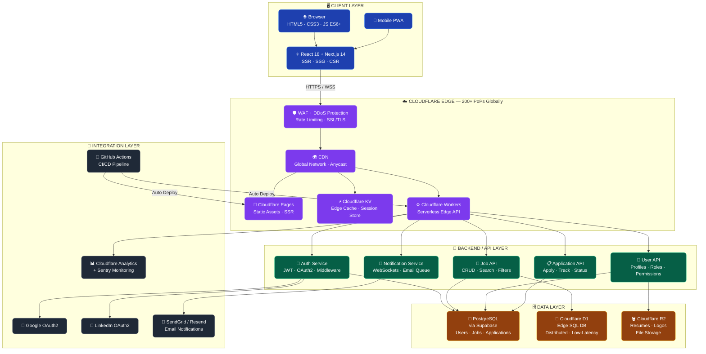
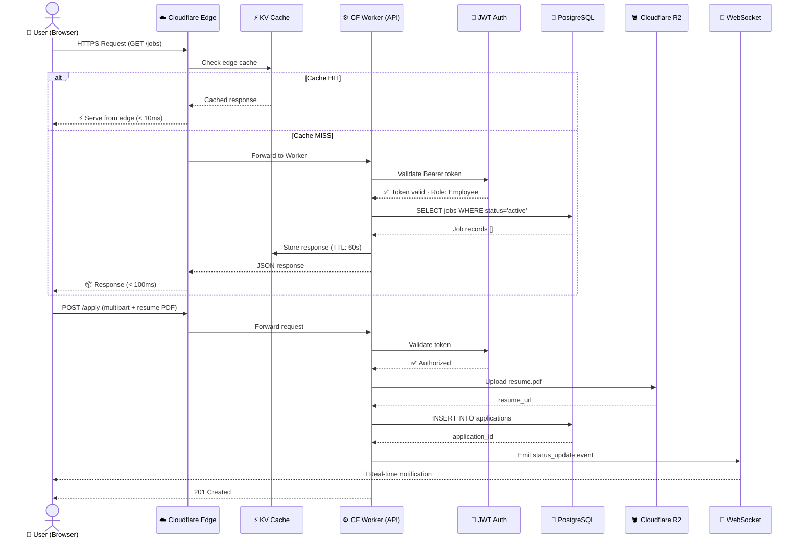
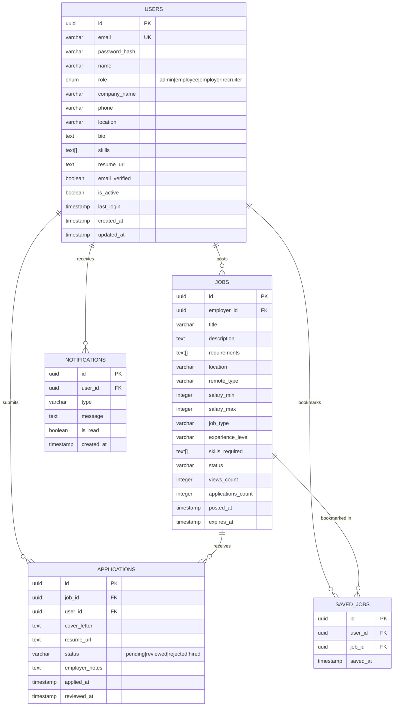
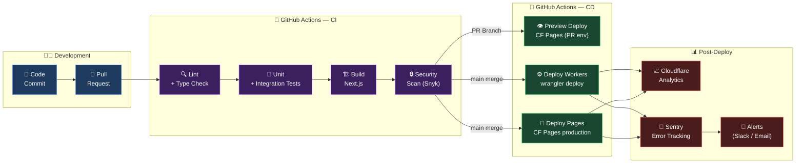

<div align="center">

# 🎯 Job Platform Hub

**Enterprise-Grade Job Board Platform | Connecting Talent with Opportunity**

[](https://github.com/prashumishra1204/Job-platform-hub/stargazers)
[](https://github.com/prashumishra1204/Job-platform-hub/network/members)
[](https://github.com/prashumishra1204/Job-platform-hub/blob/main/LICENSE)
[](https://github.com/prashumishra1204/Job-platform-hub/issues)
[](https://github.com/prashumishra1204/Job-platform-hub/pulls)


[](https://github.com/prashumishra1204/Job-platform-hub/pulls)

<br/>

### Created with ❤️ by **[Prashu Mishra](https://github.com/prashumishra1204)**
*Full Stack Developer | Job Platform Creator*

<br/>


</div>

---

## 📖 About The Project

**Job Platform Hub** is a scalable job board platform connecting job seekers, recruiters, and employers with a modern web interface and evolving cloud-native architecture. The project currently runs with a **hybrid setup** (static frontend + session-based auth) and is being upgraded toward a **fully serverless edge-based system** using Cloudflare.

> 💡 *"To create the world's most accessible and intelligent job matching platform that connects the right talent with the right opportunity, regardless of geography or background."*

---

## 🏛️ End-to-End System Architecture

> **Full-stack system design** — from client browser through Cloudflare edge network, serverless compute, data persistence, and third-party integrations.

### 🔷 High-Level E2E Flow



---

### 🔄 Request Lifecycle — Data Flow



---

### 🗃️ Database Entity Relationship



---

### 🚀 CI/CD Deployment Pipeline



---

## 🚀 Live Demo

| Platform | URL | Status |
|----------|-----|--------|
| **GitHub Pages** | [prashumishra1204.github.io/Job-platform-hub](https://prashumishra1204.github.io/Job-platform-hub/) | ✅ Live |
| **Cloudflare Workers** | [job-platform-hub.prashumishra714.workers.dev](https://job-platform-hub.prashumishra714.workers.dev/) | ✅ Live |
| **Cloudflare Pages** | [job-platform-hub.pages.dev](https://job-platform-hub.pages.dev) | 🚧 Coming Soon |

### 🔑 Demo Credentials

| Role | Email | Password |
|------|-------|----------|
| 👑 Admin | admin@jobhub.com | admin123 |
| 💼 Employee | prashumishra714@gmail.com | 123456 |
| 🏢 Employer | employer@jhasons.com | 123456 |
| 🤝 Recruiter | recruiter@techagency.com | 123456 |

---

## 📌 Features Overview

| Category | Live — v1.0 | Upcoming — v2.0 |
|----------|-------------|-----------------|
| **UI/UX** | Responsive UI, job listings, dashboards, animations | React + Next.js, SSR/SSG, improved UX |
| **Job Management** | Create, edit, browse jobs with search & filters | Fully dynamic job APIs with optimized queries |
| **Backend** | Session-based authentication (client-side) | Cloudflare Workers serverless backend |
| **Database** | LocalStorage + sessionStorage | PostgreSQL + Cloudflare D1 + Supabase |
| **Authentication** | Session-based authentication | JWT + OAuth2 (Google, LinkedIn) + Cloudflare Access |
| **Performance** | CDN delivery via GitHub/Cloudflare | Edge caching with KV + global optimization |
| **File Storage** | Not available | Cloudflare R2 for resume uploads |
| **AI Features** | Not available | AI job recommendations & resume matching |
| **Scalability** | Limited (client-side) | 2000+ concurrent users |
| **Search** | Keyword + location filter | Advanced search with Elasticsearch & pagination |
| **Security** | Basic session security | WAF, DDoS protection, rate limiting |
| **Monitoring** | Not available | Cloudflare Analytics + Workers metrics |
| **Notifications** | Not available | Email + WebSockets real-time updates |

---

## 🏗️ Architecture Comparison

| Component | Current — v1.0 | Target — v2.0 |
|-----------|----------------|----------------|
| **Frontend** | Static HTML5 / CSS3 / JS ES6+ | React 18 + Next.js 14 (SSR/SSG) |
| **Backend** | Client-side only (localStorage) | Cloudflare Workers (serverless edge) |
| **Database** | LocalStorage / sessionStorage | PostgreSQL + Cloudflare D1 + Supabase |
| **Cache** | None | Cloudflare KV (edge cache) |
| **File Storage** | None | Cloudflare R2 |
| **Auth** | Session-based (localStorage) | JWT + OAuth2 (Google / LinkedIn) |
| **Hosting** | GitHub Pages / Cloudflare Workers | Cloudflare Pages (production) |
| **CDN** | Basic CDN | Cloudflare Global Network (200+ PoPs) |
| **Notifications** | None | Email + WebSockets |
| **CI/CD** | Manual deploy | GitHub Actions → Cloudflare |
| **Monitoring** | None | Cloudflare Analytics + Sentry |
| **Security** | Basic | WAF + DDoS + Rate Limiting |

---

## 🧠 Technology Stack

### Current Stack — v1.0

| Technology | Version | Purpose |
|------------|---------|---------|
| HTML5 | Latest | Structure |
| CSS3 | Latest | Styling & animations |
| JavaScript | ES6+ | Logic & interactivity |
| Font Awesome | 6.0 | Icons |
| Google Fonts | Latest | Typography |
| LocalStorage | — | Client-side data persistence |
| GitHub Pages | — | Static hosting |
| Cloudflare Workers | — | API routing |

### Target Stack — v2.0

| Category | Technology | Purpose |
|----------|------------|---------|
| **Frontend** | React 18 + Next.js 14 | Modern SPA with SSR |
| **State Management** | Redux Toolkit | Global state |
| **Styling** | Tailwind CSS | Utility-first CSS |
| **Backend** | Cloudflare Workers | Serverless edge computing |
| **Database** | PostgreSQL + Supabase | Primary database |
| **Edge Database** | Cloudflare D1 | Distributed SQL |
| **Cache** | Cloudflare KV | Edge caching |
| **Storage** | Cloudflare R2 | File storage (resumes) |
| **Auth** | JWT + OAuth2 | Secure authentication |
| **Email** | SendGrid / Resend | Notifications |
| **Monitoring** | Cloudflare Analytics | Performance metrics |

---

## ⚙️ Features Implemented — v1.0

### 👤 User Management

| Feature | Status | Details |
|---------|--------|---------|
| Multi-role Registration | ✅ Complete | Admin / Employee / Employer / Recruiter |
| Secure Login / Logout | ✅ Complete | Session-based authentication |
| Session Persistence | ✅ Complete | Maintained via localStorage |
| Profile Management | ✅ Complete | Editable user profiles |
| Role-Based Access | ✅ Complete | Permission-based system |

### 💼 Job Management

| Feature | Status | Details |
|---------|--------|---------|
| Job Posting | ✅ Complete | Create & manage listings |
| Job Browsing | ✅ Complete | Grid / list view |
| Job Details | ✅ Complete | Full job information page |
| Search & Filter | ✅ Complete | Keyword & location filters |
| Save Jobs | ✅ Complete | Bookmark feature |
| Share Jobs | ✅ Complete | Social media sharing |

### 📄 Application System

| Feature | Status | Details |
|---------|--------|---------|
| Apply for Jobs | ✅ Complete | One-click apply |
| Track Applications | ✅ Complete | Dashboard tracking |
| Application History | ✅ Complete | Logs with timestamps |
| Status Updates | ✅ Complete | Pending / Reviewed / Rejected / Hired |
| Duplicate Prevention | ✅ Complete | No duplicate applications |

### 🎨 UI/UX Features

| Feature | Status | Details |
|---------|--------|---------|
| Responsive Design | ✅ Complete | Mobile-first approach |
| Dark Mode | ✅ Complete | Theme toggle |
| Toast Notifications | ✅ Complete | User feedback system |
| Loading Animations | ✅ Complete | Skeleton loaders |
| Smooth Transitions | ✅ Complete | CSS animations |
| Card Hover Effects | ✅ Complete | Interactive UI elements |

---

## 🔐 User Roles & Permissions

| Permission | Employee | Employer | Recruiter | Admin |
|------------|:--------:|:--------:|:---------:|:-----:|
| Browse Jobs | ✅ | ✅ | ✅ | ✅ |
| Apply for Jobs | ✅ | ❌ | ❌ | ❌ |
| Save Jobs | ✅ | ❌ | ❌ | ❌ |
| Post Jobs | ❌ | ✅ | ✅ | ✅ |
| Edit Jobs | ❌ | ✅ | ✅ | ✅ |
| Delete Jobs | ❌ | ✅ | ✅ | ✅ |
| View Applicants | ❌ | ✅ | ✅ | ✅ |
| Update Application Status | ❌ | ✅ | ✅ | ✅ |
| View Analytics | ❌ | ✅ | ✅ | ✅ |
| Manage Users | ❌ | ❌ | ❌ | ✅ |
| Platform Settings | ❌ | ❌ | ❌ | ✅ |

---

## 🗄️ Database Schema

### Current: LocalStorage

```javascript
const localStorageSchema = {
  users: [{ id, name, email, password, role, company, createdAt }],
  jobs: [{ id, title, company, location, type, salary, description, requirements, employerId, postedAt }],
  applications: [{ id, jobId, userId, status, appliedAt }]
};
```

### Planned: PostgreSQL + Supabase — v2.0

```sql
-- Users Table
CREATE TABLE users (
    id              UUID PRIMARY KEY DEFAULT gen_random_uuid(),
    email           VARCHAR(255) UNIQUE NOT NULL,
    password_hash   VARCHAR(255) NOT NULL,
    name            VARCHAR(255) NOT NULL,
    role            VARCHAR(50) CHECK (role IN ('admin', 'employee', 'employer', 'recruiter')),
    company_name    VARCHAR(255),
    phone           VARCHAR(20),
    location        VARCHAR(255),
    bio             TEXT,
    skills          TEXT[],
    resume_url      TEXT,
    email_verified  BOOLEAN DEFAULT FALSE,
    is_active       BOOLEAN DEFAULT TRUE,
    last_login      TIMESTAMP,
    created_at      TIMESTAMP DEFAULT NOW(),
    updated_at      TIMESTAMP DEFAULT NOW()
);

-- Jobs Table
CREATE TABLE jobs (
    id                  UUID PRIMARY KEY DEFAULT gen_random_uuid(),
    employer_id         UUID REFERENCES users(id),
    title               VARCHAR(255) NOT NULL,
    description         TEXT,
    requirements        TEXT[],
    location            VARCHAR(255),
    remote_type         VARCHAR(50),
    salary_min          INTEGER,
    salary_max          INTEGER,
    job_type            VARCHAR(50),
    experience_level    VARCHAR(50),
    skills_required     TEXT[],
    status              VARCHAR(50) DEFAULT 'active',
    views_count         INTEGER DEFAULT 0,
    applications_count  INTEGER DEFAULT 0,
    posted_at           TIMESTAMP DEFAULT NOW(),
    expires_at          TIMESTAMP
);

-- Applications Table
CREATE TABLE applications (
    id              UUID PRIMARY KEY DEFAULT gen_random_uuid(),
    job_id          UUID REFERENCES jobs(id),
    user_id         UUID REFERENCES users(id),
    cover_letter    TEXT,
    resume_url      TEXT,
    status          VARCHAR(50) DEFAULT 'pending',
    employer_notes  TEXT,
    applied_at      TIMESTAMP DEFAULT NOW(),
    reviewed_at     TIMESTAMP
);
```

---

## 📊 Version Roadmap

| Version | Release | Status | Key Features |
|---------|---------|--------|--------------|
| **v1.0** | March 2026 | ✅ Live | Static site, 4 user roles, localStorage, search/filter |
| **v1.1** | April 2026 | 🚧 In Progress | Bug fixes, UI animations, Naukri.com integration |
| **v2.0** | Q3 2026 | 📋 Planned | Supabase DB, PostgreSQL migration, Cloudflare Workers |
| **v2.1** | Q4 2026 | 📋 Planned | OAuth (Google/LinkedIn), real-time notifications |
| **v3.0** | Q1 2027 | 📋 Planned | AI job matching, resume parsing, mobile apps |

---

## 🔄 Coming in v3.0

### 🗄️ Database Integrations

| Feature | Status | Description |
|---------|--------|-------------|
| Supabase Integration | 🚧 In Progress | PostgreSQL with real-time subscriptions |
| Cloudflare D1 | 📋 Planned | Edge database for global low-latency access |
| Cloudflare KV | 📋 Planned | Edge caching for frequently accessed data |
| Cloudflare R2 | 📋 Planned | File storage for resumes and company logos |
| Data Migration Tool | 📋 Planned | Migrate from localStorage to cloud database |
| Backup & Restore | 📋 Planned | Automated daily backups |
| Data Encryption | 📋 Planned | AES-256 encryption for sensitive data |

### 🔌 API Integrations

| API | Status | Purpose |
|-----|--------|---------|
| Supabase API | 🚧 In Progress | Primary database operations |
| Cloudflare Workers API | 📋 Planned | Serverless backend endpoints |
| RESTful API | 📋 Planned | Standard CRUD operations |
| GraphQL API | 📋 Planned | Flexible data queries |
| WebSocket API | 📋 Planned | Real-time notifications |

### 🔐 OAuth Integrations

| Provider | Status | Purpose |
|----------|--------|---------|
| Google OAuth | 📋 Planned | Social login |
| LinkedIn OAuth | 📋 Planned | Professional profile import |
| GitHub OAuth | 📋 Planned | Developer portfolio |

---

## ⚡ Performance Metrics

| Metric | Current — v1.0 | Target — v2.0 |
|--------|----------------|----------------|
| Page Load Time | 1.2s | < 0.8s |
| Time to Interactive | 1.8s | < 1.2s |
| First Contentful Paint | 0.8s | < 0.5s |
| Lighthouse Score | 95+ | 98+ |
| Concurrent Users | Limited (client-side) | 2000+ |
| API Response Time | N/A | < 100ms |
| Uptime | 99.9% (CDN) | 99.99% |

---

## 🔒 Current Limitations — v1.0

| Limitation | Impact | Solution in v2.0 |
|------------|--------|------------------|
| No persistent database | Data clears with browser cache | PostgreSQL + Supabase |
| No real-time features | Delayed notifications | WebSockets + Cloudflare Queues |
| No email integration | Manual communication | SendGrid / Resend API |
| Single session only | No multi-device sync | JWT + Redis sessions |
| No analytics | No usage insights | Cloudflare Analytics |
| Manual deployment | Slower updates | GitHub Actions CI/CD |
| No file uploads | No resume storage | Cloudflare R2 |
| Basic search | Limited filtering | Elasticsearch |

---

## 🛠️ Local Development

```bash
# Clone the repository
git clone https://github.com/prashumishra1204/Job-platform-hub.git
cd Job-platform-hub

# Run with Python
python -m http.server 8000

# Or with Node.js
npx serve

# Open in browser
open http://localhost:8000
```

---

## 🤝 Contributing

Contributions are welcome! Please follow these steps:

1. Fork the repository
2. Create a feature branch: `git checkout -b feature/amazing-feature`
3. Commit your changes: `git commit -m 'Add amazing feature'`
4. Push to branch: `git push origin feature/amazing-feature`
5. Open a Pull Request

---

## 📋 Changelog

### v1.1.0 — April 2026 *(Current)*
- Fixed search functionality
- Added animations and transitions
- Dark mode support
- Toast notifications
- Naukri.com integration
- Bug fixes and performance improvements

### v1.0.0 — March 2026
- Initial release
- 4 user roles: Admin, Employee, Employer, Recruiter
- Job posting and browsing
- Application system
- LocalStorage persistence
- Responsive design

---

## 📄 License

This project is licensed under the [MIT License](LICENSE).

---

## 📞 Contact & Support

| Type | Contact |
|------|---------|
| Developer | Prashu Mishra |
| Email | prashumishra714@gmail.com |
| GitHub | [@prashumishra1204](https://github.com/prashumishra1204) |
| Project Issues | [GitHub Issues](https://github.com/prashumishra1204/Job-platform-hub/issues) |
| Live Demo | [Job Platform Hub](https://prashumishra1204.github.io/Job-platform-hub/) |

---

## 🙏 Acknowledgments

- [Font Awesome](https://fontawesome.com) — Icons
- [Google Fonts](https://fonts.google.com) — Typography
- [Cloudflare](https://cloudflare.com) — Hosting and edge services
- [Supabase](https://supabase.com) — Database solutions
- All contributors and testers ❤️

---

<div align="center">

### ⭐ Star this repo if you find it useful!

[](https://github.com/prashumishra1204/Job-platform-hub)
[](https://github.com/prashumishra1204/Job-platform-hub/network/members)
[](https://github.com/prashumishra1204/Job-platform-hub/watchers)

<br/>

Made with ❤️ by **[Prashu Mishra](https://github.com/prashumishra1204)**

</div>
